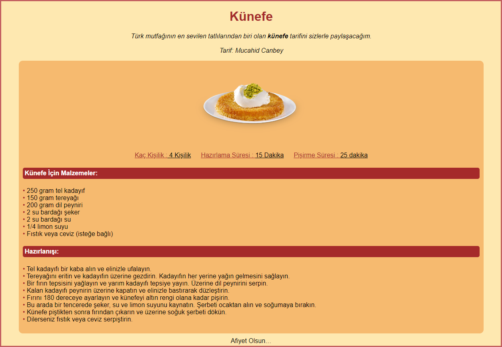

## 
## HTML ÖDEV 3


## 

---


Bu repo [Kodluyoruz](https://www.kodluyoruz.org/) Front-End Eğitiminde oluşturduğum Html ödev Reposu. İçerisinde bir adet README dosyası, 1 adet .html uzantısı dosya barındırıyor.

## Installation

Öncelikle projeyi clonelayın.

```
https://github.com/mucahidcanbey/html_odev_3.git
```

## Usage

Projeyi cloneladıktan sonra Visual Studio Code programında açınız.

Linux için:

```
cd html_odev_3
code .
```

## Contributing
Pull requestler kabul edilir. Büyük değişiklikler için, lütfen önce neyi değiştirmek istediğinizi tartışmak için bir konu açınız.

## License
[MIT](https://choosealicense.com/licenses/mit/)
